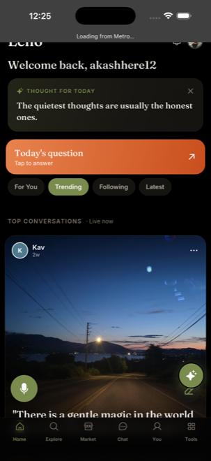
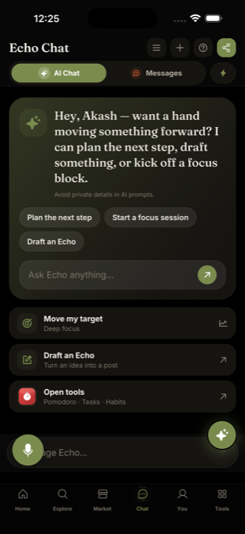
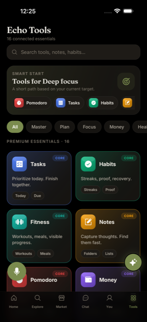
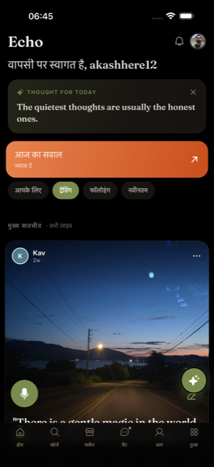
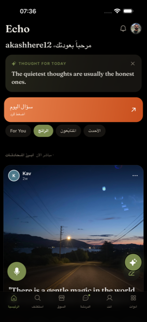

<div align="center">

# Echo

**A voice-first social network with an AI that listens, acts and translates.**

Built for India · 26 languages · iOS, Android, web and desktop from one codebase

<sub>Pre-launch — in polish ahead of store submission. No public users yet.</sub>

</div>

<div align="center">






</div>

---

## Why Echo exists

Most people don't type the way they think. Writing a full thought in Devanagari or Tamil on a phone is slow enough that most people simply don't — the thought gets shortened, or never posted. And apps that do translate usually translate the *content* while leaving an English interface around it, so the product never feels like it was made for you.

Echo starts from the other end. You speak, and the app does the rest.

**Three things make it different from a generic social app:**

**Voice-first, not voice-added.** One recording becomes a transcript, a structured intent and a spoken reply in a single model call. The app *acts* on what you said — posts it, searches it, opens the tool you asked for — rather than just dictating it into a text box.

**The interface is localised, not just the content.** Greeting, filter tabs, navigation, prompts and layout direction all follow the reader. The same build renders left-to-right in Hindi and right-to-left in Arabic.

**A reason to come back that isn't the scroll.** One Daily Question, the same for everyone, that *closes* — you answer, you read what the network said, you're done until tomorrow. Plus a shelf of everyday tools, so there's a reason to open Echo on a day you have nothing to post.

<div align="center">



<br />
<sub>Same screen, same build — English, हिन्दी, العربية</sub>
</div>

---

## What's built

| | |
|---|---|
| Screens | 87 |
| Database tables | 68 — row-level security on all 68, across 201 policies |
| Edge functions | 19 |
| Migrations | 124 |
| Mini-apps | 16 in the catalog, 23 routes in the tree |
| Languages | 26 — 13 Indian, 13 global |
| First-party TypeScript | ~98,900 lines |
| Unit tests | 315, Vitest |

Counts are derived from the tree rather than maintained by hand. Re-derive them before quoting them anywhere.

### Feature surface

- **Social** — posts with image and video, comments, reactions, reposts, follows, bookmarks, blocks, mutes, notifications
- **Messaging** — one-to-one and group DMs with media, reactions, read state and presence
- **Voice** — hold to talk; speech, intent and reply resolved in one model round trip, mapped onto 18 in-app actions
- **AI** — assistant chat with tool-calling, plus runtime interface translation and embeddings-based recommendation
- **Daily Question** — a seeded, self-healing question bank with reactions and divergent-view discovery
- **Mini-apps** — habits, tasks, notes, planner, expenses, fitness, pomodoro and more, syncing across devices
- **Community & commerce** — salons, office hours, a peer marketplace, and first-party in-feed advertising
- **Trust & safety** — an LLM moderation gate on text *and* uploaded images before anything reaches the feed, reports queue, moderator role, statement-of-reasons and a six-month appeals window. Video is not visually checked yet — a still-image model cannot read an mp4, and no frame is extracted during transcode.

---

## Architecture

```
        iOS · Android · Web · Electron desktop
                        │
        React Native 0.81 · Expo SDK 54 · expo-router
        TanStack Query · Zustand · MMKV
                        │
          ┌─────────────┴─────────────┐
          │                           │
   Cloudflare Worker              Supabase
   (Hono · aws4fetch)             · Postgres + row-level security
   · signed R2 uploads            · Auth — email/phone OTP, Google
   · DM media access control      · Realtime
          │                       · 19 Deno edge functions
          │                           │
   Cloudflare R2                 Google Gemini 2.5
   5 media buckets               via OpenRouter
```

**Where the data physically lives.** Postgres and auth run in Supabase `ap-northeast-1` (Tokyo). All uploaded media is in Cloudflare R2. AI inference, crash reporting and analytics are in the United States. This matters for the privacy policy and for cross-border rules — see [`constants/legal/privacyPolicy.ts`](constants/legal/privacyPolicy.ts).

### Stack

| Layer | Choice |
|---|---|
| Client | React Native 0.81, Expo SDK 54, expo-router |
| Server state | TanStack Query, persisted to MMKV |
| Client state | Zustand |
| Backend | Supabase — Postgres, Auth, Realtime, Deno edge functions |
| Object storage | Cloudflare R2, fronted by a Hono Worker |
| AI | Google Gemini 2.5 (flash / flash-lite / pro) via OpenRouter |
| Payments | Razorpay for ad orders (live). Subscriptions are **not wired**: the RevenueCat webhook and entitlements table exist server-side, but the client ships no purchase SDK and `getCurrentPlan()` returns `free` for everyone |
| Observability | Sentry, PostHog (consent-gated) |
| Tests | Vitest, Maestro |

---

## Getting started

**Prerequisites:** Node 20+, and the Expo tooling. iOS builds need Xcode; Android needs a JDK 17.

```bash
git clone https://github.com/Ak2556/echo-mobile.git
cd echo-mobile
npm ci

cp .env.example .env      # add your Supabase URL and anon key
npm start                 # then press i, a or w
```

Without Supabase credentials the app runs against offline mock data, so you can explore the UI immediately.

### Everyday commands

```bash
npm start                 # dev server
npm run ios               # native iOS build
npm run android           # native Android build
npm run typecheck         # tsc --noEmit
npm run lint
npm test                  # Vitest
npm run legal:sbom        # regenerate NOTICE and sbom.json
npm run i18n:generate     # fill machine translations for UI strings
```

---

## Testing

**Unit — 315 tests, Vitest.** Covers feed filtering and scoring, the engagement model, publish validation, marketplace logic, URL safety, the age gate boundaries, i18n date handling and the voice intent dispatcher. Several exist to pin bugs that were invisible in review rather than to describe behaviour: that the auth lock actually serializes, that the session on disk is unreadable, that every `profiles` column the client selects is granted, that the DM thread renders through the real bubble renderer.

**End-to-end — Maestro.** A cold-launch flow runs on every pull request against an Android emulator: first paint, and the Terms and Privacy routes. It first got as far as running the flow on 24 August 2026 — before that it had never built an APK at all, dying in six seconds on a device error, then on Gradle heap during packaging. That first real run failed, and usefully: it caught a bug no unit test could, in that the legal routes were unreachable without an account. The fix landed the same day, so the first fully green run is still ahead of us. Budget ~40 minutes for the job; the release build alone is around 31.

The signed-in flows — bottom-tab navigation and DM threads — stay manual, because sign-in is a one-time code sent to a real inbox and CI has no way to receive it. Flows and their prerequisites are documented in [`e2e/`](e2e/).

**Human — across ten age groups.** The build is being tested by people spanning ten age brackets, on their own devices and in their own languages. Automated tests catch regressions; they don't tell you that a filter tab reads as a button to a sixteen-year-old and as decoration to a sixty-year-old, or that a Hindi speaker looks for the mic before the keyboard. Most of the interface changes worth making so far have come from watching someone hold the phone.

---

## Repository layout

```
app/                  expo-router screens — file-based routing
components/           shared UI
src/features/         feature modules — feed, chat, auth, voice
src/shared/           theme, i18n, platform helpers
lib/                  API wrappers, domain logic, mini-app data
constants/legal/      Terms, Privacy Policy, entity facts, age policy
supabase/             migrations and edge functions
cloudflare/           the R2 worker
e2e/                  Maestro flows
scripts/              i18n, SBOM and legal-translation generators
```

---

## Things worth knowing before you contribute

These are real, current, and would otherwise cost you an afternoon.

- **`android/` and `ios/` are generated.** They're prebuild output and gitignored. Change `app.json`, never the native projects.
- **Echo does not have end-to-end encrypted messaging.** `src/shared/lib/e2ee.ts` implements a keypair, but nothing calls it and the live DM path writes plaintext. Both files carry banners saying so. Please don't describe Echo as end-to-end encrypted. The *session* is encrypted at rest — an AES-256 key in the Keychain, the session itself in AsyncStorage under it — which is a different claim.
- **Write RLS policies as `(select auth.uid())`, never bare `auth.uid()`.** Postgres treats the bare call as volatile and re-runs it per row scanned; the subquery form is evaluated once per statement. All 167 policies that reference it were converted in `20260824160000`; a new one written the old way silently reintroduces the problem on the table it guards.
- **Adding a column to `profiles`? Grant it.** That table has column-level grants, so a single ungranted column fails the *entire* select with `42501` — one forgotten grant takes out every screen running that query. `lib/profilesColumnGrants.test.ts` fails the build if the client selects something that was never granted.
- **Moderation is fail-closed.** A post stays hidden until the classifier passes it. That means a throttled or unfunded `OPENROUTER_API_KEY` does not degrade moderation — it silently stops publishing.
- **Offline has two layers.** WatermelonDB backs direct messages — `useDatabaseSync()` runs from `app/_layout.tsx` on mount and on foreground. Everything else relies on TanStack Query persisted to MMKV with a seven-day window, plus AsyncStorage and server sync for mini-apps.
- **The feed is ranked**, not chronological — follows, engagement and content embeddings. A chronological **Latest** tab is the alternative.
- **Account deletion goes through the `delete-account` edge function**, not the `delete_account()` RPC. The RPC only reaches Postgres; media lives in R2 and has to be purged first.
- **The mini-app catalog is the source of truth** for what ships. `lib/miniAppCatalog.ts`.
- **Unresolved legal facts are greppable:** `grep -rn "\[\[" constants/legal/`

---

## Legal and compliance

The Terms and Privacy Policy live in code, so the app and any web mirror can never drift apart. Both are **drafts pending counsel review**.

- [`constants/legal/termsOfService.ts`](constants/legal/termsOfService.ts) — v3.0 draft
- [`constants/legal/privacyPolicy.ts`](constants/legal/privacyPolicy.ts) — v3.0 draft
- [`constants/legal/entity.ts`](constants/legal/entity.ts) — unresolved entity facts, as `[[PLACEHOLDER]]`
- [`constants/legal/ageGate.ts`](constants/legal/ageGate.ts) — age thresholds, mirrored in SQL
- [`constants/legal/eighthSchedule.ts`](constants/legal/eighthSchedule.ts) — the 22 languages DPDP Act 2023 §5 requires notices to be available in

`NOTICE` and `sbom.json` record third-party attribution and licence elections, and regenerate with `npm run legal:sbom`.

**Age policy:** minimum age 16. Under 18, Echo serves no advertising and performs no behavioural profiling — enforced in Postgres, not on the device, and it fails closed on unknown age.

---

## Roadmap

**Now** — polish, store submission, India launch.

**Next** — subscriptions once the free tier demonstrably retains; first-party advertising for local and regional brands; more mini-apps in the categories people already return for.

**Then** — the 13 global languages already built into the product, and deeper OS integration: App Intents and Shortcuts on iOS so Siri can drive the existing intent vocabulary, widgets and a share target on both platforms.

---

## Licence

See [`LICENSE`](LICENSE).

> This repository is currently public under the MIT licence, with copyright attributed to an individual GitHub handle rather than an operating entity. That is under review and expected to change before launch.

---

<div align="center">
<sub>Built by <a href="https://github.com/Ak2556">Akash Thakur</a></sub>
</div>
