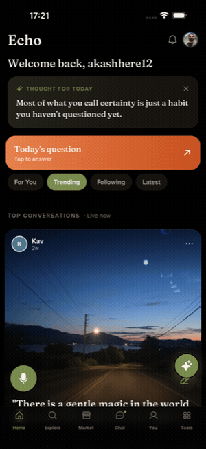
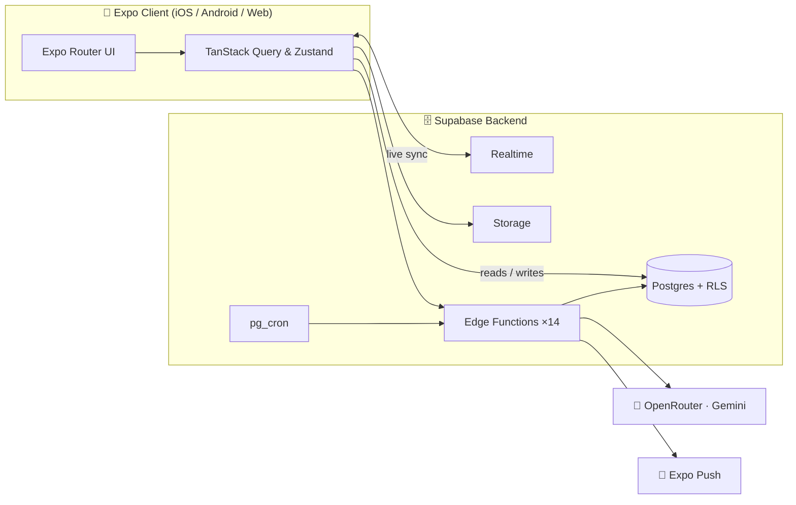

<div align="center">

# 🔊 Echo

### Think out loud. In your voice. In your language.

**Echo is where a passing thought becomes a conversation — and a conversation becomes a community.**

Talk to an AI that thinks _with_ you. Publish what's worth keeping. Answer one question a day alongside the world. All by voice. In **25 languages**.

<br/>

[](https://expo.dev)
[](https://reactnative.dev)
[](https://www.typescriptlang.org)
[](https://supabase.com)
[](#)
[](LICENSE)

<sub>📱 iOS · 🤖 Android · 🌐 Web — one beautifully unified codebase</sub>

<br/>

<table>
<tr>
<td align="center"><br><sub><b>An AI that thinks with you</b></sub></td>
<td align="center"><br><sub><b>One question a day</b></sub></td>
<td align="center"><br><sub><b>A toolkit that grows with you</b></sub></td>
</tr>
</table>

</div>

---

## 🌟 The Vision

> **Most social platforms just want to steal your attention. Echo wants to capture your best thoughts.**

We're drowning in noise and infinite scrolling feeds. Echo is built differently. We envisioned a sanctuary for thinkers, creators, and tinkerers—an ecosystem that values depth over brevity, and intention over distraction. 

Imagine brainstorming with a world-class AI while you walk, publishing your most insightful moments to a global audience, and discovering how vastly different minds around the globe tackle the exact same daily questions. That is Echo.

---

## ✨ Magnetic Features

- 🎙️ **Just Talk. We Listen.** <br> Open the app and _speak_. Whether you want to post a thought, jump to a new screen, or search the feed, there's no typing required. The microphone is always one tap away, turning your natural voice into instant action.
  
- 🌍 **It Speaks Your Language (Literally).** <br> Every screen is seamlessly translated into **25 languages**, complete with flawless right-to-left (RTL) support. Pick your native tongue and watch the entire interface morph instantly. Geography is no longer a barrier to great ideas.

- 🤖 **Your Personal AI Co-Pilot.** <br> Echo isn't just an autocomplete; it's a sounding board. Plan your next ambitious project, draft a manifesto, or kick off a focus block with an AI that pushes back and expands your thinking. Then, publish the brilliant parts as a public **Echo**.

- 🗣️ **The Global Daily Question.** <br> Answer one profound question a day. Once you commit your answer, you unlock the world's responses. See how your closest friends answered, and discover the boldest outliers from across the globe.

- 🔎 **A Feed That Actually Learns You.** <br> No more algorithmic outrage. We use advanced vector embeddings to rank discovery by what you actually find valuable, engaging, and thought-provoking.

- 🧩 **A Toolkit That Grows With You.** <br> Echo features an ever-growing suite of mini-apps. Track habits, log fitness, manage money, complete tasks, or run a Pomodoro timer—all powered by an AI coach that reads your real numbers and adapts to your life.

- 🛡️ **Safe, Healthy, Transparent.** <br> We built Echo to be EU DSA-aligned from day one. Enjoy pre-publish moderation, transparent community decisions, and a real appeals flow. A healthy community isn't an afterthought; it's the foundation.

---

## 🎙️ Say It. Done.

Tap the mic and speak naturally. Echo's advanced intent recognition engine translates your raw voice into precise navigation and creation.

```text
"Take me home"          →   Jumps instantly to the Home screen
"Post a new thought…"   →   Opens the composer, pre-filled with your spoken words
"What's the question?"  →   Navigates to today's daily question
"Open chat"             →   Summons your AI thinking partner
```

No menus. No hunting. **The whole app, entirely hands-free.**

---

## 🌍 One App. Every Language.

The _same_ screen, the moment you switch — no reload, no half-translated corners. 

<div align="center">



<sub><b>English → हिन्दी → العربية (RTL)</b> · Hand-authored core with on-demand AI translation for the long tail, cached securely on your device.</sub>

</div>

---

## 🏗️ Built for Scale. Built to Last.

Echo is a masterclass in modern cross-platform engineering. We leverage a single, unified **Expo** codebase to deploy native-feeling experiences to iOS, Android, and the Web. 

It is backed by a rock-solid **Supabase** spine: Postgres databases secured with strict Row-Level Security (RLS), Realtime WebSocket subscriptions, secure Storage, **14 Edge Functions**, and automated pg_cron jobs. 

Every AI model call runs securely server-side through **Gemini** via OpenRouter—meaning zero API secrets are ever shipped in the client bundle.



*Voice-to-intent, content moderation, semantic embeddings, translation, and user retention workflows all securely live in scalable Edge Functions (`echo-ai`, `voice-command`, `embed-echo`, `i18n-translate`, `mini-app-coach`, etc.).*

---

## 🧱 The Tech Stack

We refused to compromise on developer experience or user performance.

- **Framework:** `Expo SDK 54` & `React Native 0.81`
- **Routing:** `expo-router`
- **Language:** `TypeScript (Strict Mode)`
- **State Management:** `Zustand` & `TanStack Query`
- **Styling:** `NativeWind`
- **Animations:** `Reanimated 4`
- **Backend:** `Supabase` (Postgres, Auth, Storage, Edge Functions)
- **AI Engine:** `Gemini via OpenRouter`
- **Observability:** `Sentry` & `PostHog`

---

## 🚀 Run It Locally in 60 Seconds

Ready to dive in? Spinning up Echo is breathtakingly simple:

```bash
# 1. Clone & Install dependencies
npm ci

# 2. Setup your environment variables
cp .env.example .env      
# (Fill in your EXPO_PUBLIC_* values from your Supabase dashboard)

# 3. Start the Expo bundler
npm start                 
# Then press 'i' for iOS Simulator, 'a' for Android Emulator, or 'w' for Web
```

> **Note:** To run the backend locally, you'll need the Supabase CLI installed. Simply run `supabase start` in the project root to spin up the Postgres database and Edge Functions via Docker.

---

## 🤝 Join the Movement

We welcome dreamers and builders! Before submitting a Pull Request, please ensure you run our quality checks to keep the codebase pristine:

```bash
npm run lint
npm run typecheck
npm test
```

---

<div align="center">

**v1 — Production Ready.** Feature-complete and scaling on Supabase.

Released under the [MIT License](LICENSE) · Built with ❤️ by [`Ak2556`](https://github.com/Ak2556)

</div>
