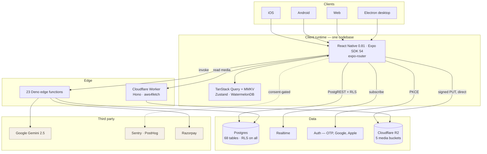
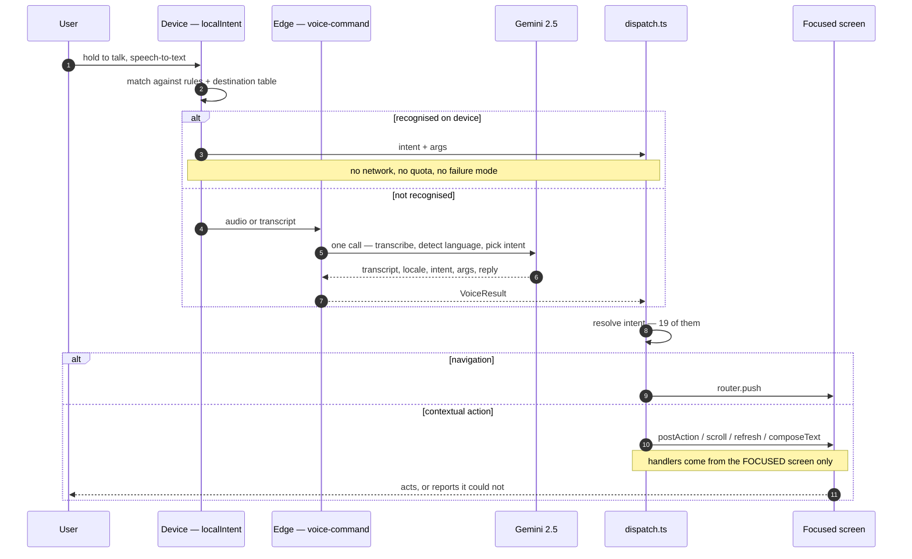
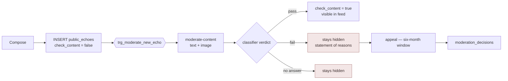
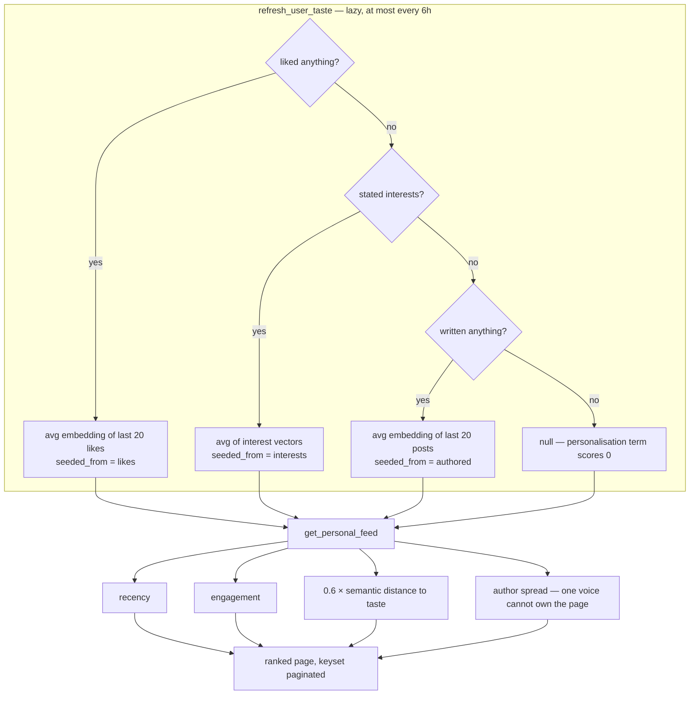
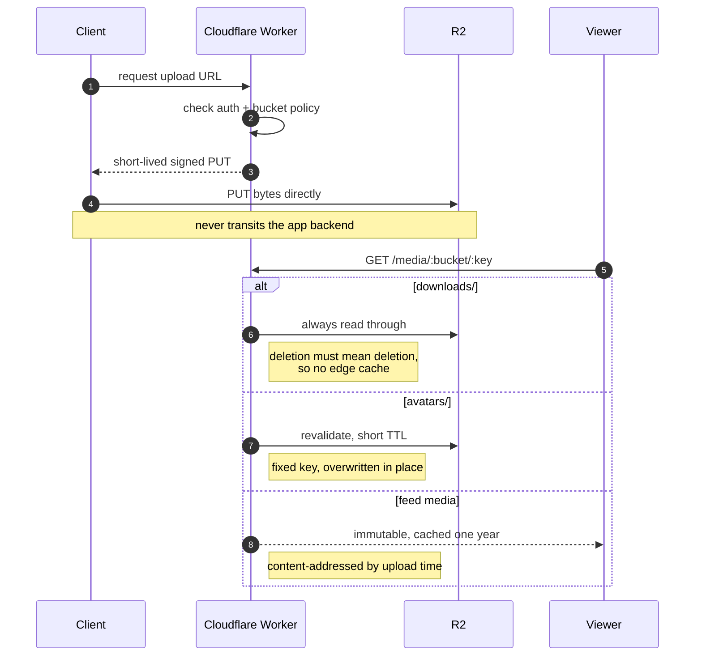
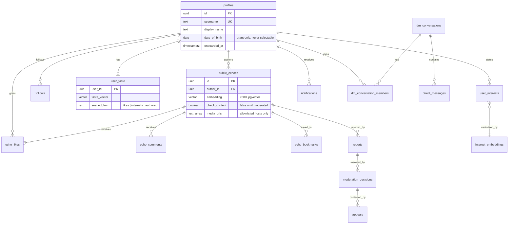
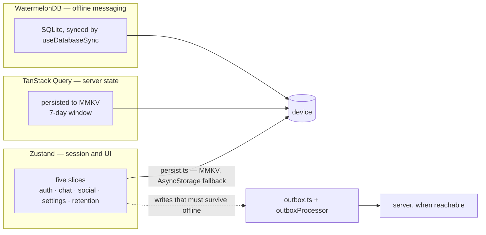

<div align="center">


# Echo

### Speak. Echo does the rest.

**A voice-first social network with an AI that listens, acts and translates.**

Built for India · 26 languages · one codebase for iOS, Android, web and desktop

<p>


</p>

<sub>Private beta — 20 testers across ten age groups. Store submission next.</sub>

<br />


<br />
<sub><b>One build.</b> The whole interface follows the reader — English, हिन्दी, العربية.</sub>

</div>

---

## Contents

**Product** · [The problem](#most-people-dont-type-the-way-they-think) · [Download](#download)

**Engineering** · [What's built](#whats-built) · [Architecture](#architecture) · [Getting started](#getting-started) · [Testing](#testing) · [Repository layout](#repository-layout)

**Contributing** · [Engineering notes](#engineering-notes) · [Known limitations](#known-limitations) · [Contributing](#contributing) · [Security](#security) · [Legal](#legal-and-compliance) · [Roadmap](#roadmap) · [Licence](#licence)

---

## Most people don't type the way they think

Writing a full thought in Devanagari or Tamil on a phone is slow enough that most people simply don't. The thought gets shortened, or never posted. And apps that *do* translate usually translate the content while leaving an English interface around it, so the product never feels like it was made for you.

Echo starts from the other end. **You speak, and the app does the rest.**

<table>
<tr>
<td width="33%" valign="top">

### Voice-first, not voice-added

One recording becomes a transcript, a structured intent and a spoken reply in a **single model call**. Echo *acts* on what you said — posts it, searches it, opens the tool you asked for — and when you are looking at a text box, dictates into it.

19 intents. Every screen is reachable by voice, enforced by a test. Navigation never calls the model: the map is finite and resolved on the device.

</td>
<td width="33%" valign="top">

### The interface is localised, not just the content

Greeting, filter tabs, navigation, prompts and layout direction all follow the reader. The same build renders left-to-right in Hindi and right-to-left in Arabic.

26 languages — 13 Indian, 13 global. The translation data is currently being regenerated; see [Known limitations](#known-limitations).

</td>
<td width="33%" valign="top">

### A reason to return that isn't the scroll

One Daily Question, the same for everyone, that **closes**: you answer, you read what the network said, you're done until tomorrow.

Plus a shelf of everyday tools, for the days you have nothing to post.

</td>
</tr>
</table>

<div align="center">


</div>

## Download

**Coming to the App Store and Google Play.** Until then, [downloadecho.com](https://downloadecho.com).

---

## What's built

| | |
|---|---|
| Screens | 92 — every one reachable by voice, enforced by a test |
| Database tables | 68 — row-level security on all 68, across 201 policies |
| Edge functions | 23 |
| Migrations | 187 |
| Mini-apps | 22 in the catalog, 23 routes in the tree |
| Languages | 26 — 13 Indian, 13 global |
| First-party TypeScript | ~111,100 lines |
| Unit tests | 1,267 across 124 files, Vitest |

Counts are derived from the tree and the live database rather than maintained by hand. Re-derive them before quoting them anywhere; the table and policy counts need a live database to check.

### Feature surface

| Area | What ships |
|---|---|
| **Social** | Posts with image and video, comments, reactions, reposts, follows, bookmarks, blocks, mutes, notifications |
| **Messaging** | One-to-one and group DMs with media, reactions, read state and presence |
| **Voice** | Hold to talk; speech, intent and reply resolved in one model round trip, mapped onto 19 intents. Every screen reachable, 17 long-form fields accepting dictation, lists scrolling a page at a time. Dictation fills the field and never submits — a mis-transcription should not be able to publish, or reply to someone, on its own |
| **AI** | Assistant chat with tool-calling, runtime interface translation, embeddings-based recommendation |
| **Daily Question** | A seeded, self-healing question bank with reactions and divergent-view discovery |
| **Mini-apps** | Habits, tasks, notes, planner, expenses, fitness, pomodoro and more, syncing across devices |
| **Community & commerce** | Salons, office hours, a peer marketplace, first-party in-feed advertising |
| **Trust & safety** | An LLM moderation gate on text *and* uploaded images before anything reaches the feed; reports queue, moderator role, statement-of-reasons, six-month appeals window |

---

## Architecture

```
        iOS · Android · Web · Electron desktop
                        │
        React Native 0.81 · Expo SDK 54 · expo-router
        TanStack Query · Zustand · MMKV
                        │
          ┌─────────────┴─────────────┐
          │                           │
   Cloudflare Worker              Supabase
   (Hono · aws4fetch)             · Postgres + row-level security
   · signed R2 uploads            · Auth — email/phone OTP, Google, Apple
   · DM media access control      · Realtime
          │                       · 23 Deno edge functions
          │                           │
   Cloudflare R2                 Google Gemini 2.5
   5 media buckets               direct, OpenRouter as fallback
```

**Where the data physically lives.** Postgres and auth run in Supabase `ap-northeast-1` (Tokyo). All uploaded media is in Cloudflare R2. AI inference, crash reporting and analytics are in the United States. This matters for the privacy policy and for cross-border rules — see [`constants/legal/privacyPolicy.ts`](constants/legal/privacyPolicy.ts).

### System design

<div align="center">



</div>

**Trust boundaries.** The client holds only the anon key; `service_role` never ships. Every read goes through row-level security, so a compromised client can reach exactly what its JWT allows. Media bypasses the backend entirely — the client `PUT`s to R2 through a short-lived signed URL, and reads come back through the Worker, which is the only component that can mint those signatures.

### The voice pipeline

The product's central claim, and the path most worth understanding. Navigation never reaches the model.

<div align="center">



</div>

Two properties the diagram is drawn to show. **The device answers first**, so every navigation is instant and costs nothing — the model is only consulted for phrasings the local table cannot resolve. And **handlers belong to the focused screen**, never the mounted one; when a screen blurs the dispatcher sees nothing rather than falling back, because a stale action is worse than no action when the user cannot tell what it hit.

### Publishing is fail-closed

<div align="center">



</div>

A post is invisible until the classifier passes it, which means an unfunded or throttled AI key does not quietly degrade moderation — it stops publishing. That is the intended failure direction, and it is worth knowing before you debug "posts are not appearing".

### How the feed decides what you see

<div align="center">



</div>

The fallback chain runs strongest-evidence-first: a like is what someone chose to *consume*, a stated interest is what they *said*, an authored post is only what they *produced*. Each is replaced the moment a stronger signal exists.

### Media path

<div align="center">



</div>

Three cache policies because the objects behave differently. A distributable build under `downloads/` has to be revocable, so it is read straight from R2 every time; an avatar lives at a fixed key and is overwritten in place, so it revalidates on a short TTL; everything else is content-addressed and never rewritten, so a year of immutable caching is free correctness.

### Core data model

The social core, of 68 tables.

<div align="center">



</div>

### State, in three layers

<div align="center">



</div>

Writes that must survive a dead connection go through the outbox rather than the query layer, so a post written on a train is sent when the train arrives rather than lost when the screen closes.

### Stack

| Layer | Choice |
|---|---|
| Client | React Native 0.81, Expo SDK 54, expo-router |
| Server state | TanStack Query, persisted to MMKV |
| Client state | Zustand |
| Backend | Supabase — Postgres, Auth, Realtime, Deno edge functions |
| Object storage | Cloudflare R2, fronted by a Hono Worker |
| AI | Google Gemini 2.5 (flash / flash-lite / pro), direct, with OpenRouter as fallback |
| Payments | Razorpay for ad orders (live). Subscriptions are not wired — see [Known limitations](#known-limitations) |
| Observability | Sentry, PostHog (consent-gated) |
| Tests | Vitest, Maestro |

### Security posture

- Row-level security on every table in the public schema, with no permissive policy on anything private
- Policies use the `(select auth.uid())` InitPlan form, so the planner evaluates identity once per statement rather than once per row scanned
- The session is encrypted at rest — AES-256-GCM, key in the Keychain, payload in AsyncStorage
- PKCE with SHA-256 challenges; a custom-scheme redirect never carries a refresh token
- `service_role` appears nowhere in the client bundle
- Media is uploaded straight to R2 through a signed URL and never touches the app backend

---

## Getting started

**Prerequisites:** Node 20+ and the Expo tooling. iOS builds need Xcode; Android needs JDK 17 — not 21 or 24, on which the CMake step fails with a misleading message. If you have `direnv`, `direnv allow` pins the JDK and Android SDK for you; otherwise see [docs/deployment/android-build.md](docs/deployment/android-build.md).

```bash
git clone https://github.com/Ak2556/echo-mobile.git
cd echo-mobile
npm ci

cp .env.example .env      # add your Supabase URL and anon key
npm start                 # then press i, a or w
```

Without Supabase credentials the app runs against offline mock data, so you can explore the UI immediately.

### Everyday commands

```bash
npm start                 # dev server
npm run ios               # native iOS build
npm run android           # native Android build
npm run typecheck         # tsc --noEmit
npm run lint
npm test                  # Vitest
npm run legal:sbom        # regenerate NOTICE and sbom.json
npm run i18n:generate     # regenerate machine translations from English
```

---

## Testing

**Unit — 1,267 tests across 124 files, Vitest.** Covers feed filtering and scoring, the engagement model, publish validation, marketplace logic, URL safety, the age gate boundaries, i18n date handling and the voice intent dispatcher.

Several exist to pin bugs that were invisible in review rather than to describe behaviour: that the auth lock actually serializes, that the session on disk is unreadable, that every `profiles` column the client selects is granted, that the DM thread renders through the real bubble renderer, that no screen ships without a way to reach it by voice.

**End-to-end — Maestro.** A cold-launch flow runs on every pull request against an Android emulator: first paint, and the Terms and Privacy routes. It first got as far as running the flow on 24 August 2026 — before that it had never built an APK at all, dying in six seconds on a device error, then on Gradle heap during packaging. That first real run failed, and usefully: it caught a bug no unit test could, in that the legal routes were unreachable without an account. The fix landed the same day, so the first fully green run is still ahead of us. Budget ~40 minutes for the job; the release build alone is around 31.

The signed-in flows — bottom-tab navigation and DM threads — stay manual, because sign-in is a one-time code sent to a real inbox and CI has no way to receive it. Flows and their prerequisites are documented in [`e2e/`](e2e/).

**Human — 20 testers across ten age groups.** The build is in the hands of people spanning ten age brackets, on their own devices and in their own languages. Automated tests catch regressions; they don't tell you that a filter tab reads as a button to a sixteen-year-old and as decoration to a sixty-year-old, or that a Hindi speaker looks for the mic before the keyboard. Most of the interface changes worth making so far have come from watching someone hold the phone.

---

## Repository layout

```
app/                  expo-router screens — file-based routing
components/           shared UI
src/features/         feature modules — feed, chat, auth, voice
src/shared/           theme, i18n, platform helpers
lib/                  API wrappers, domain logic, mini-app data
constants/legal/      Terms, Privacy Policy, entity facts, age policy
supabase/             migrations and edge functions
cloudflare/           the R2 worker
e2e/                  Maestro flows
scripts/              i18n, SBOM and legal-translation generators
```

---

## Engineering notes

Real, current, and each would otherwise cost you an afternoon.

- **`android/` and `ios/` are generated.** They are prebuild output and gitignored. Change `app.json`, never the native projects.
- **Write RLS policies as `(select auth.uid())`, never bare `auth.uid()`.** Postgres treats the bare call as volatile and re-runs it per row scanned; the subquery form is evaluated once per statement. All 167 policies that reference it were converted in `20260824160000`; a new one written the old way silently reintroduces the problem on the table it guards.
- **Adding a column to `profiles`? Grant it.** That table has column-level grants, so a single ungranted column fails the *entire* select with `42501` — one forgotten grant takes out every screen running that query. `lib/profilesColumnGrants.test.ts` fails the build if the client selects something that was never granted. `upsert` needs the INSERT grant too, not just UPDATE: Postgres checks column INSERT privileges on an `INSERT … ON CONFLICT` whichever path runs.
- **Moderation is fail-closed.** A post stays hidden until the classifier passes it. A throttled or unfunded AI key does not degrade moderation — it silently stops publishing.
- **Offline has two layers.** WatermelonDB backs direct messages; `useDatabaseSync()` runs from `app/_layout.tsx` on mount and on foreground. Everything else relies on TanStack Query persisted to MMKV with a seven-day window, plus AsyncStorage and server sync for mini-apps.
- **The feed is ranked**, not chronological — follows, engagement and content embeddings. A chronological **Latest** tab is the alternative.
- **Account deletion goes through the `delete-account` edge function**, not the `delete_account()` RPC. The RPC only reaches Postgres; media lives in R2 and has to be purged first.
- **The mini-app catalog is the source of truth** for what ships: [`lib/miniAppCatalog.ts`](lib/miniAppCatalog.ts).
- **Anything you can tap, you should be able to say.** A test walks `app/` and fails if a screen has no voice phrase, or a multiline field no dictation handler. Exclusions live in the test with a written reason each.
- **Translate from English, and check the output.** `scripts/translate_i18n.py` seeded every language from the *Bengali* block and truncated each value; it now refuses to run. `npm run i18n:generate` is the supported path, and [`src/shared/lib/i18nIntegrity.test.ts`](src/shared/lib/i18nIntegrity.test.ts) fails the build on those signatures.
- **Do not run `npm audit fix --force`.** It clears four advisories by downgrading `expo-router` from 6.x to 5.1.11, which is a different framework. Of the four, `image-size` reaches the tree only through metro and never ships, and the `decode-uri-component` patch is ESM-only while `query-string` requires it as CommonJS — forcing it breaks deep-link parsing. There is no safe upgrade today, and the audit will keep saying otherwise.
- **Unresolved legal facts are greppable:** `grep -rn "\[\[" constants/legal/`

---

## Known limitations

Stated plainly, because each is easy to assume the other way.

| Limitation | Detail |
|---|---|
| **End-to-end encryption is 1:1 text only, and ships off** | One-to-one text, link, contact and shared-Echo DMs are sealed on the device (`lib/e2ee/`) when the remote flag `e2eeSend` is on and the recipient has a published device key. Photos, voice, groups and older messages are not. The flag ships off; until it is flipped, the DM path writes plaintext. What may and may not be claimed publicly is in `docs/runbook/e2ee-rollout.md`. |
| **Video is not visually moderated** | Text and still images pass an LLM gate before reaching the feed. A still-image model cannot read an mp4, and no frame is extracted during transcode. |
| **Subscriptions are not wired** | The RevenueCat webhook and entitlements table exist server-side, but the client ships no purchase SDK and `getCurrentPlan()` returns `free` for everyone. |
| **Translation data is being regenerated** | The interface localisation works; the strings do not yet. A generator seeded every language from the Bengali block rather than English and dropped the last character of each value — 228 shipped strings end in a bare virama, impossible in every Indic script involved. The pipeline is fixed and validated; the re-run from English is pending. |
| **Licence attribution is provisional** | Copyright is attributed to an individual GitHub handle rather than an operating entity. Under review before launch. |

---

## Contributing

Issues and pull requests are welcome. Before opening one:

1. Read [Engineering notes](#engineering-notes) — most surprises are listed there.
2. Run `npm run lint`, `npm run typecheck` and `npm test`. CI runs all three on every push and pull request to `main`; matching them locally is faster than a round trip.
3. Keep commits focused, and explain *why* in the body rather than restating the diff.

Coverage tests will fail the build if a new screen has no voice phrase, a new multiline field no dictation handler, or a new `profiles` column no grant. These are deliberate: they encode promises the product makes.

---

## Security

Found a vulnerability? Please report it privately rather than opening a public issue. Reach the maintainer through [downloadecho.com](https://downloadecho.com) or `security@downloadecho.com`.

Row-level security, session encryption and the PKCE configuration are described under [Security posture](#security-posture). Note the two claims Echo does **not** make: end-to-end encryption beyond one-to-one text messages (see `docs/runbook/e2ee-rollout.md`), and visual moderation of video.

---

## Legal and compliance

The Terms and Privacy Policy live in code, so the app and any web mirror can never drift apart. Both are **drafts pending counsel review**.

- [`constants/legal/termsOfService.ts`](constants/legal/termsOfService.ts) — v3.0 draft
- [`constants/legal/privacyPolicy.ts`](constants/legal/privacyPolicy.ts) — v3.0 draft
- [`constants/legal/entity.ts`](constants/legal/entity.ts) — unresolved entity facts, as `[[PLACEHOLDER]]`
- [`constants/legal/ageGate.ts`](constants/legal/ageGate.ts) — age thresholds, mirrored in SQL
- [`constants/legal/eighthSchedule.ts`](constants/legal/eighthSchedule.ts) — the 22 languages DPDP Act 2023 §5 requires notices to be available in

`NOTICE` and `sbom.json` record third-party attribution and licence elections, and regenerate with `npm run legal:sbom`.

**Age policy:** minimum age 16. Under 18, Echo serves no advertising and performs no behavioural profiling — enforced in Postgres, not on the device, and it fails closed on unknown age.

---

## Roadmap

| Horizon | Work |
|---|---|
| **Now** | Polish, store submission, India launch |
| **Next** | Subscriptions once the free tier demonstrably retains; first-party advertising for local and regional brands; more mini-apps in the categories people already return for |
| **Then** | The 13 global languages already built into the product, and deeper OS integration — App Intents and Shortcuts on iOS so Siri can drive the existing intent vocabulary, widgets and a share target on both platforms |

---

## Licence

MIT. See [`LICENSE`](LICENSE).

---

<div align="center">
<sub>Built by <a href="https://github.com/Ak2556">Akash Thakur</a> · <a href="https://downloadecho.com">downloadecho.com</a></sub>
</div>
