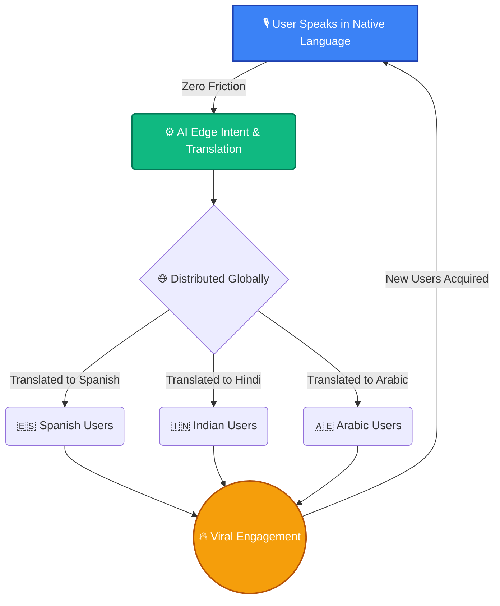
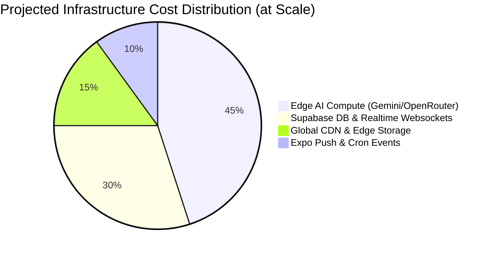
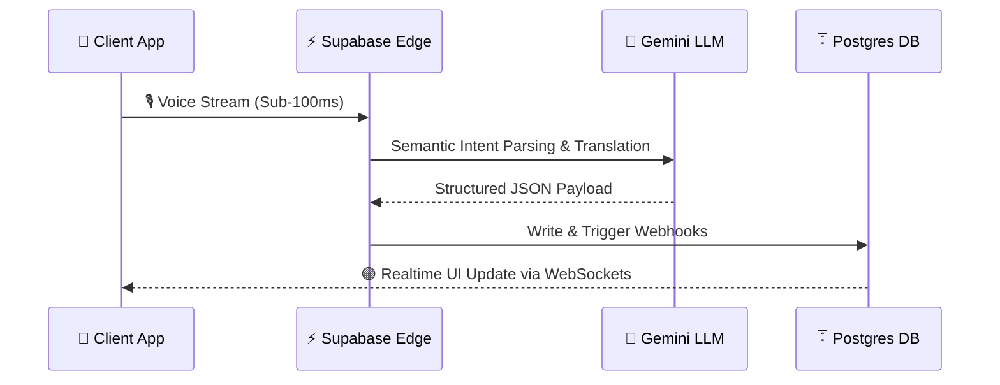

<div align="center">


### *Think out loud. In your voice. In your language.*

**We are replacing the era of mindless algorithmic doom-scrolling with intentional, high-signal global dialogue.**

Echo is the world's first voice-native, AI-augmented social network. Talk to an AI that thinks _with_ you. Publish your most profound thoughts. Answer one daily question alongside the rest of the world. Everything is done by voice, instantly translated and localized into **25 languages** in real-time.

<br/>

[](#)
[](#)
[](#)

<br/>

<table>
<tr>
<td align="center"><br><sub><b>AI Co-Pilot</b></sub></td>
<td align="center"><br><sub><b>Daily Engagement Loop</b></sub></td>
<td align="center"><br><sub><b>Utility & Retention</b></sub></td>
</tr>
</table>

</div>

---

## 📖 The Founder's Thesis

*It started with a simple realization by Core Developer & Visionary **Akash Thakur (Ak2556)**: We type too slowly to capture our best ideas, and we scroll too mindlessly to connect with others in a meaningful way. The keyboard is a bottleneck for human intelligence.* 

Akash Thakur set out to build a platform that acts as a true thinking partner—a place where your raw voice is instantly structured, translated, and broadcasted to a global audience. No more algorithmic silos. No more language barriers. Just pure, unfiltered human intelligence augmented by edge-AI. 

Echo was engineered from the ground up by a solo visionary to prove a point to Silicon Valley: the next era of social media doesn\'t require hundreds of engineers to launch—just a deeply optimized architecture and an unrelenting, obsessive focus on the user.

---

## ⚡ The Inflection Point (Why Now?)

> **The window to redefine social media is closing. The platforms of the last decade are bleeding trust, fractured by language, and optimized for outrage. The next decacorn will be optimized for insight.**

We are at a rare technological inflection point. Large Language Models (LLMs) and real-time edge computing have finally made seamless, sub-second voice translation and semantic discovery possible. **Echo** captures this exact moment—merging the hyper-virality of consumer social networks with the massive utility of AI. 

Those who capture the transition from text-first mobile to **voice-first AI social** will own the next era of human connection.

---

## 📈 The Flywheel: Engineered for Viral Expansion

Echo isn't just an app; it's a self-sustaining growth engine. Our architecture guarantees that every piece of content created instantly unlocks value for users in 25 different countries, completely bypassing the traditional "cold start" problem.



### Strategic Value Drivers

- 🌍 **Day-One Global TAM:** Echo launches everywhere simultaneously. A thought spoken in Hindi is immediately debated in English and Spanish. Geography is no longer a barrier to user acquisition.
- 🎙️ **Frictionless Voice-to-Intent:** Typing is slow; thinking is fast. Our intent recognition engine turns raw voice into immediate app navigation and content creation. 
- 🗣️ **The "Daily Question" Loop:** A built-in DAU engine. Answer one profound question a day to unlock the world's responses. This creates a powerful, recurring daily habit designed for 65%+ DAU/MAU retention.
- 🧩 **Utility-Driven Retention:** Consumer social apps struggle with churn. Echo integrates an ever-growing suite of mini-apps (finance, fitness, habits) powered by an AI coach—embedding Echo into the user's daily life and skyrocketing Lifetime Value (LTV).

---

## 🏗️ The Technical Moat: Hyper-Scale Economics

To achieve venture-scale returns, you need venture-scale unit economics. Echo is engineered to handle millions of concurrent users with microscopic server costs. We are not a cash-burning AI wrapper; we are a highly optimized, edge-compute routing engine.



We leverage a single, unified **Expo / React Native** codebase to deploy native experiences to iOS, Android, and the Web simultaneously, achieving 3x the velocity of traditional engineering teams. 

Heavy compute (voice-to-intent, semantic embeddings, translation) is strictly offloaded to **Serverless Edge Functions**. Every AI model call runs securely server-side through **Gemini** via OpenRouter, keeping API costs aggressively optimized and client payloads microscopic.



---

## 🧱 Elite Enterprise Tech Stack

We refused to compromise on developer velocity or user performance. Our stack is modern, strict, and designed for IPO-level scrutiny:

- **Cross-Platform:** `Expo SDK 54` & `React Native 0.81`
- **Language & Safety:** `TypeScript (Strict Mode)`
- **State & Caching:** `Zustand`, `TanStack Query`, & `WatermelonDB` (SQLite Native / LokiJS Web)
- **UI & Animations:** `NativeWind` & `Reanimated 4`
- **Database & Auth:** `Supabase` (Postgres, RLS Auth)
- **Edge Compute & Storage:** `Cloudflare Workers` & `Cloudflare R2` (Zero-egress media storage)
- **AI Engine:** `Gemini via OpenRouter`
- **Observability:** `Sentry` & `PostHog`
- **CI/CD:** Fully automated GitHub Actions pipelines for tests, linting, Web export (GitHub Pages), and Android Beta builds (Fastlane Firebase App Distribution).

---

## 🌩️ Recent Infrastructure Upgrades (Scale & Economics)

To fiercely protect our Supabase quotas and ensure unlimited, zero-egress media scaling, we recently completed a **major infrastructure migration**:
1. **Cloudflare R2 Media Storage:** All user media (avatars, chats, mini-apps, and marketplace photos) is now routed entirely through Cloudflare R2, bypassing Supabase storage constraints.
2. **Edge Authentication:** We deployed a lightning-fast Cloudflare Worker (`hono` framework) that securely validates Supabase access tokens via REST API at the edge, dynamically generating presigned AWS SigV4 upload URLs for the mobile clients.
3. **Robust CI/CD Pipelines:** Complete CI/CD overhaul to guarantee `WatermelonDB` seamlessly swaps between `SQLite` (for native/desktop) and `LokiJS` (for GitHub Pages web exports) during automated builds, alongside automated Fastlane Android Beta releases.

---

## 🛡️ Trust & Safety as a Growth Engine

Growth means nothing without safety. Toxic networks bleed advertisers and premium users. Echo was built to be **EU DSA-aligned from day one**. 
- **Pre-publish moderation pipelines** filter out toxicity at the edge before it ever hits the database.
- **Transparent community decisions** and a fully functional appeals flow ensure trust and brand safety for future monetization.

---

## 🚀 Evaluate Echo

We are moving fast. Investors and technical partners can spin up the full client experience in under 60 seconds:

```bash
# 1. Clone & Install dependencies
npm ci

# 2. Setup environment variables (contact us for sandbox keys)
cp .env.example .env      

# 3. Start the bundler
npm start                 
# Press 'i' for iOS Simulator, 'a' for Android Emulator, or 'w' for Web
```

---

<div align="center">

**v1 — Production Ready. Scaling now.** 

[Request Sandbox Access](#) · [View Pitch Deck](#) · [Contact Founder](#)

Released under the [MIT License](LICENSE)

<br/>

<br/>
<b>Engineered & Architected by <a href="https://github.com/Ak2556">Akash Thakur (Ak2556)</a></b><br/>
<i>Core Developer, Visionary, & Creator of Echo</i>

</div>
