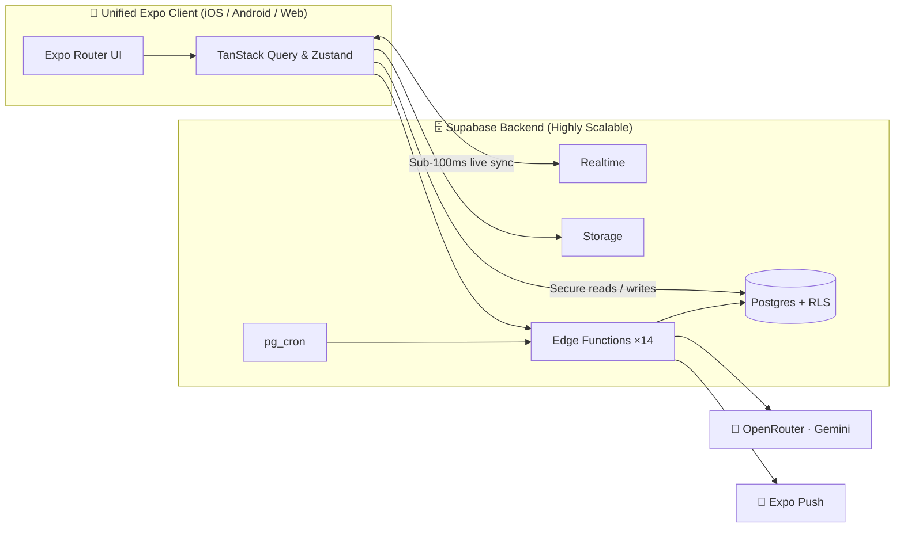

<div align="center">

# 🔊 Echo: The Next Generation of Social Intelligence

### Think out loud. In your voice. In your language.

**Echo is a voice-first, AI-augmented social network designed to capture the world's most valuable thoughts.**

We are replacing mindless algorithmic scrolling with intentional, high-quality global dialogue. Talk to an AI that thinks _with_ you. Publish what's worth keeping. Answer one question a day alongside the world. All by voice. Instantly localized into **25 languages**.

<br/>

[](https://expo.dev)
[](https://reactnative.dev)
[](https://supabase.com)
[](#)

<sub>📱 iOS · 🤖 Android · 🌐 Web — One highly scalable codebase</sub>

<br/>

<table>
<tr>
<td align="center"><br><sub><b>AI Co-Pilot</b></sub></td>
<td align="center"><br><sub><b>Daily Engagement Loop</b></sub></td>
<td align="center"><br><sub><b>Utility & Retention</b></sub></td>
</tr>
</table>

</div>

---

## 📈 The Opportunity & The Vision

> **The current social landscape is fractured by language and optimized for outrage. Echo is optimized for insight and scale.**

**The Problem:** Legacy social networks are bleeding user trust and engagement due to toxic feeds and language silos. Meanwhile, AI is largely isolated in single-player productivity tools. 

**The Solution:** Echo merges the virality of social networks with the utility of AI. We are building a sanctuary for thinkers, creators, and tinkerers—an ecosystem that values depth over brevity. By removing the friction of typing and the barrier of language, Echo captures high-signal human thought at a global scale from day one.

---

## 🚀 Strategic Value Drivers

- 🌍 **Day-One Global TAM (Total Addressable Market)** <br> Echo doesn't launch in one country; it launches everywhere. Every screen, post, and interaction is seamlessly translated into **25 languages** (including full RTL support). Geography is no longer a barrier to user acquisition.

- 🎙️ **Frictionless Voice-to-Intent (UX Innovation)** <br> Typing is slow; thinking is fast. The microphone is always one tap away. Our advanced intent recognition engine turns raw voice into immediate app navigation, content creation, and search. 

- 🤖 **AI as a Multiplayer Co-Pilot** <br> Echo brings AI out of the silo. Users brainstorm with a world-class AI, push their thinking further, and instantly publish the best insights to a public feed. AI is the creation catalyst.

- 🗣️ **The "Daily Question" Retention Loop** <br> A built-in DAU (Daily Active User) engine. Users answer one profound question a day to unlock how the rest of the world answered. This creates a powerful, recurring daily habit and drives organic curiosity.

- 🔎 **High-Signal Algorithmic Discovery** <br> We abandoned engagement-bait algorithms. Echo uses advanced vector embeddings to rank discovery by semantic resonance and what users actually find valuable—guaranteeing high-quality feed curation.

- 🧩 **Mini-App Ecosystem (Utility Retention)** <br> Social apps struggle with churn; utility apps struggle with acquisition. Echo combines both. An ever-growing suite of mini-apps (habit tracking, finance, fitness) powered by an AI coach embeds Echo into the user's daily life, skyrocketing LTV (Lifetime Value).

---

## 🏗️ The Technical Moat: Built for Hyper-Scale

Echo is engineered to handle millions of users with incredibly lean operating costs. 

We leverage a single, unified **Expo / React Native** codebase to deploy native-feeling experiences to iOS, Android, and the Web simultaneously. Our backend is powered by a rock-solid **Supabase** spine: Postgres databases secured with strict Row-Level Security (RLS), Realtime WebSocket subscriptions, and secure Storage.

Heavy compute (voice-to-intent, content moderation, semantic embeddings, translation) is offloaded to **14 serverless Edge Functions**. Every AI model call runs securely server-side through **Gemini** via OpenRouter, keeping API costs optimized and client payloads microscopic.



---

## 🧱 Elite Tech Stack

We refused to compromise on developer velocity or user performance. Our stack is modern, strict, and enterprise-ready:

- **Cross-Platform:** `Expo SDK 54` & `React Native 0.81`
- **Language & Safety:** `TypeScript (Strict Mode)`
- **State & Caching:** `Zustand` & `TanStack Query`
- **UI & Animations:** `NativeWind` & `Reanimated 4`
- **Database & Auth:** `Supabase` (Postgres, RLS Auth, Storage)
- **AI Engine:** `Gemini via OpenRouter`
- **Observability:** `Sentry` & `PostHog`

---

## 🛡️ Trust & Safety (Enterprise Grade)

Growth means nothing without safety. Echo was built to be **EU DSA-aligned from day one**. 
- **Pre-publish moderation pipelines** filter out toxic content before it hits the database.
- **Transparent community decisions** and a fully functional appeals flow ensure trust.
- A healthy community isn't an afterthought; it is our foundation for sustainable scale.

---

## 🚀 Evaluate Echo Locally

Investors and technical partners can spin up the full client experience in under 60 seconds:

```bash
# 1. Clone & Install dependencies
npm ci

# 2. Setup environment variables (contact us for sandbox keys)
cp .env.example .env      

# 3. Start the bundler
npm start                 
# Press 'i' for iOS Simulator, 'a' for Android Emulator, or 'w' for Web
```

---

<div align="center">

**v1 — Production Ready. Scaling now.** 

Released under the [MIT License](LICENSE) · Built by [`Ak2556`](https://github.com/Ak2556)

</div>
