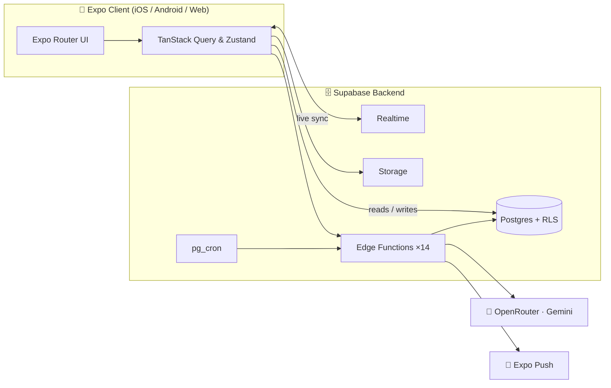

<div align="center">

# 🔊 Echo

### Think out loud. In your voice. In your language.

**Echo is where a passing thought becomes a conversation — and a conversation becomes a community.**

Talk to an AI that thinks _with_ you. Publish what's worth keeping. Answer one question a day alongside the world. All by voice. In **25 languages**.

<br/>

[](https://expo.dev)
[](https://reactnative.dev)
[](https://www.typescriptlang.org)
[](https://supabase.com)
[](#)
[](LICENSE)

<sub>📱 iOS · 🤖 Android · 🌐 Web — one beautifully unified codebase</sub>

<br/>

<table>
<tr>
<td align="center"><br><sub><b>An AI that thinks with you</b></sub></td>
<td align="center"><br><sub><b>One question a day</b></sub></td>
<td align="center"><br><sub><b>A toolkit that grows with you</b></sub></td>
</tr>
</table>

</div>

---

## 🌟 Why Echo?

Most social platforms just want to steal your attention. **Echo wants to capture your best thoughts.**

We've built a sanctuary for thinkers, creators, and tinkerers. It's an ecosystem where you can brainstorm with a world-class AI, publish your most insightful moments, and discover how others around the globe tackle the same daily questions.

- 🎙️ **Just talk.** Open the app and _speak_. Whether you want to post a thought, jump to a new screen, or search the feed. No typing required. The mic is always one tap away.
- 🌍 **It speaks your language — all of it.** Every screen, seamlessly translated into **25 languages** (including right-to-left languages). Pick yours and the entire app follows instantly.
- 🤖 **Your Personal AI Partner.** Echo isn't just an autocomplete. It's a sounding board. Plan your next project, draft a manifesto, or kick off a focus block — then publish the brilliant parts as a public **Echo**.
- 🗣️ **One question a day.** Answer first, then unlock how the rest of the world answered. See responses from people you follow, and discover the boldest outliers.
- 🔎 **A feed that learns you.** We use advanced vector embeddings to rank discovery by what you actually find valuable, not just what's loud or trending.
- 🧩 **A toolkit that grows with you.** Track habits, log fitness, manage money, complete tasks, or run a Pomodoro timer. Echo features an ever-growing suite of mini-apps powered by an AI coach that reads your real numbers.
- 🛡️ **Safe by design.** Pre-publish moderation, transparent decisions, and a real appeals flow — built to be healthy and EU DSA-aligned from day one.

---

## 🎙️ Say it. Done.

Tap the mic and speak naturally. Echo turns your words into actions using advanced intent recognition.

```text
"Take me home"          →   Jumps instantly to the Home screen
"Post a new thought…"   →   Opens the composer, pre-filled with your spoken words
"What's the question?"  →   Navigates to today's daily question
"Open chat"             →   Summons your AI thinking partner
```

No menus. No hunting. **The whole app, entirely hands-free.**

---

## 🌍 One app. Every language.

The _same_ screen, the moment you switch — no reload, no half-translated corners. 

<div align="center">


<sub><b>English → हिन्दी → العربية (RTL)</b> · Hand-authored core with on-demand AI translation for the long tail, cached securely on your device.</sub>

</div>

---

## 🏗️ Built to last

One unified **Expo** codebase deploying to iOS, Android, and Web. 
Backed by a rock-solid **Supabase** spine — Postgres with strict Row-Level Security, Realtime subscriptions, Storage, **14 Edge Functions**, and automated cron jobs. 
Every AI model call runs securely server-side through **Gemini** — meaning zero API secrets are ever shipped in the client bundle.



Voice → intent, content moderation, semantic embeddings, translation, and retention workflows all securely live in scalable Edge Functions (`echo-ai`, `voice-command`, `embed-echo`, `i18n-translate`, `mini-app-coach`, etc.).

---

## 🧱 Tech Stack Under the Hood

- **Framework:** `Expo SDK 54` & `React Native 0.81`
- **Routing:** `expo-router`
- **Language:** `TypeScript (strict)`
- **State Management:** `Zustand` & `TanStack Query`
- **Styling:** `NativeWind`
- **Animations:** `Reanimated 4`
- **Backend:** `Supabase` (Postgres, Auth, Storage, Edge Functions)
- **AI:** `Gemini via OpenRouter`
- **Observability:** `Sentry` & `PostHog`

---

## 🚀 Run it in 60 seconds

Want to spin it up locally? It's as easy as:

```bash
# 1. Install dependencies
npm ci

# 2. Setup your environment variables
cp .env.example .env      
# (Fill in your EXPO_PUBLIC_* values from your Supabase dashboard)

# 3. Start the Expo bundler
npm start                 
# Then press 'i' for iOS Simulator, 'a' for Android Emulator, or 'w' for Web
```

> **Note:** To run the backend locally, you'll need the Supabase CLI installed. Simply run `supabase start` in the project root to spin up the Postgres database and Edge Functions via Docker.

---

## 🤝 Contributing

We welcome community contributions! Before submitting a Pull Request, please ensure you run our quality checks:
```bash
npm run lint
npm run typecheck
npm test
```

---

<div align="center">

**v1 — Production Ready.** Feature-complete on Supabase.

Released under the [MIT License](LICENSE) · Built with ❤️ by [`Ak2556`](https://github.com/Ak2556)

</div>
