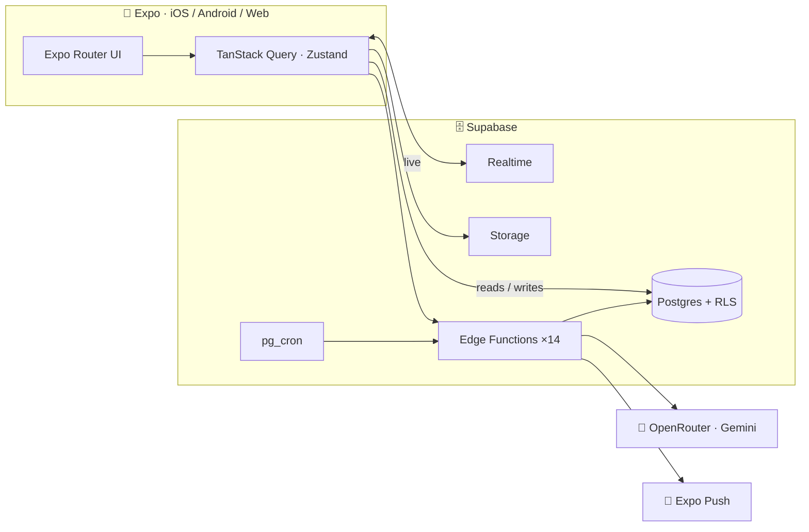

<div align="center">

# 🔊 Echo

### Think out loud. In your voice. In your language.

**Echo is where a passing thought becomes a conversation — and a conversation becomes a community.**

Talk to an AI that thinks _with_ you. Publish what's worth keeping. Answer one question a day alongside the world.
All by voice. In **25 languages**.

<br/>

[](https://expo.dev)
[](https://reactnative.dev)
[](https://www.typescriptlang.org)
[](https://supabase.com)
[](#)
[](LICENSE)

<br/>

<table>
<tr>
<td align="center"><br><sub><b>An AI that thinks with you</b></sub></td>
<td align="center"><br><sub><b>One question a day</b></sub></td>
<td align="center"><br><sub><b>A toolkit that grows with you</b></sub></td>
</tr>
</table>

</div>

---

## Why Echo?

Most apps want your attention. **Echo wants your thoughts.**

- 🎙️ **Just talk.** Open the app and _speak_ — Hindi or English. Post a thought, jump to any screen, search the feed. No typing, no menus. The mic is always one tap away.
- 🌍 **It speaks your language — all of it.** Every screen, in **25 languages**, right-to-left included. Pick yours and the whole app follows, instantly.
- 🤖 **An AI partner, not an autocomplete.** Plan the next step, draft a post, or kick off a focus block — then publish the good parts as a public **echo**.
- 🗣️ **One question a day.** Answer first, then unlock how everyone else answered — recent, from people you follow, and the boldest outliers.
- 🔎 **A feed that learns you.** Vector embeddings rank discovery by what you actually read, not just what's loud.
- 🧩 **A toolkit that grows with you.** Habits, fitness, money, tasks, pomodoro — mini-apps with an AI coach that reads your real numbers.
- 🛡️ **Safe by design.** Pre-publish moderation, transparent decisions, and a real appeals flow — EU DSA-aligned from day one.

---

## One app. Every language.

The _same_ screen, the moment you switch — English, Hindi, and a full right-to-left layout in Arabic. No reload, no half-translated corners.

<div align="center">
<table>
<tr>
<td align="center"><br><sub><b>English</b></sub></td>
<td align="center"><br><sub><b>हिन्दी</b></sub></td>
<td align="center"><br><sub><b>العربية · RTL</b></sub></td>
</tr>
</table>
<sub>A hand-authored core, on-demand AI translation for the long tail, cached on device.</sub>
</div>

---

## Built to last

One **Expo** codebase → iOS, Android, and Web. A **Supabase** spine — Postgres with row-level security, Realtime, Storage, **14 Edge Functions**, and scheduled jobs. Every model call runs server-side through **Gemini** — zero provider secrets ever ship in the app.



Voice → intent, moderation, embeddings, translation, and retention all live in Edge Functions (`echo-ai`, `voice-command`, `embed-echo`, `i18n-translate`, `mini-app-coach`, …). Deeper dive → [`docs/architecture/overview.md`](docs/architecture/overview.md).

---

## 🧱 Under the hood

`Expo SDK 54` · `React Native 0.81` · `expo-router` · `TypeScript (strict)` · `Zustand` · `TanStack Query` · `NativeWind` · `Reanimated 4` · `Supabase` · `Gemini via OpenRouter` · `Sentry` · `PostHog`

---

## 🚀 Run it in 60 seconds

```bash
npm ci
cp .env.example .env      # fill your EXPO_PUBLIC_* values
npm start                 # then press i (iOS) · a (Android) · w (Web)
```

Full setup — Supabase CLI, Edge Functions, the optional backend → [`docs/setup/local-development.md`](docs/setup/local-development.md).

---

## 📚 Docs

| | |
| --- | --- |
| 🛠️ Local dev & setup | [`docs/setup/local-development.md`](docs/setup/local-development.md) |
| 🏗️ Architecture | [`docs/architecture/overview.md`](docs/architecture/overview.md) |
| 🔐 Environment & secrets | [`docs/security/environment-and-secrets.md`](docs/security/environment-and-secrets.md) |
| 🚢 Deployment (EAS · Supabase · CI) | [`docs/deployment/deployment-guide.md`](docs/deployment/deployment-guide.md) |
| ✅ Testing | [`docs/testing/testing-guide.md`](docs/testing/testing-guide.md) |
| 🤝 Contributing & ownership | [`CONTRIBUTING.md`](CONTRIBUTING.md) |
| 🗺️ Pre-launch tracker | [`docs/pre-launch-gaps.md`](docs/pre-launch-gaps.md) |

Before a PR: `npm run lint && npm run typecheck && npm test`.

---

<div align="center">

**v1 — pre-launch.** Feature-complete on prod Supabase; final billing, store assets, and dashboard checks tracked in [`docs/pre-launch-gaps.md`](docs/pre-launch-gaps.md).

Released under the [MIT License](LICENSE) · built by [`Ak2556`](https://github.com/Ak2556)

</div>
