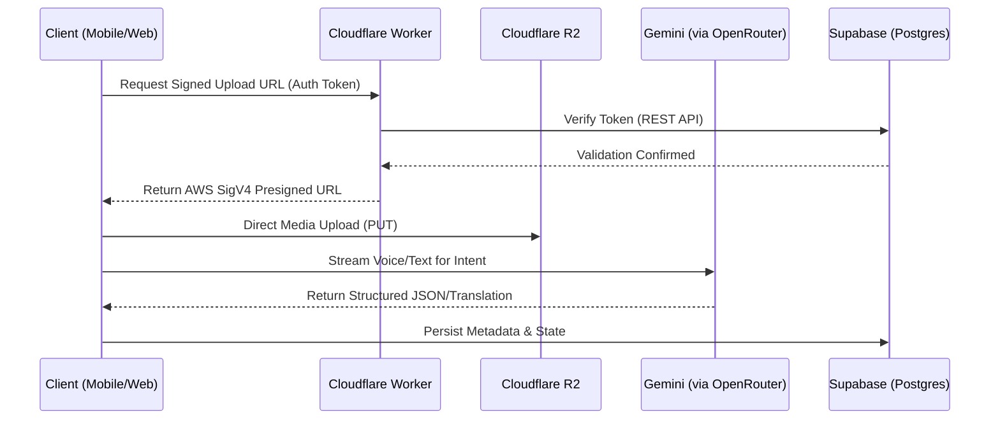
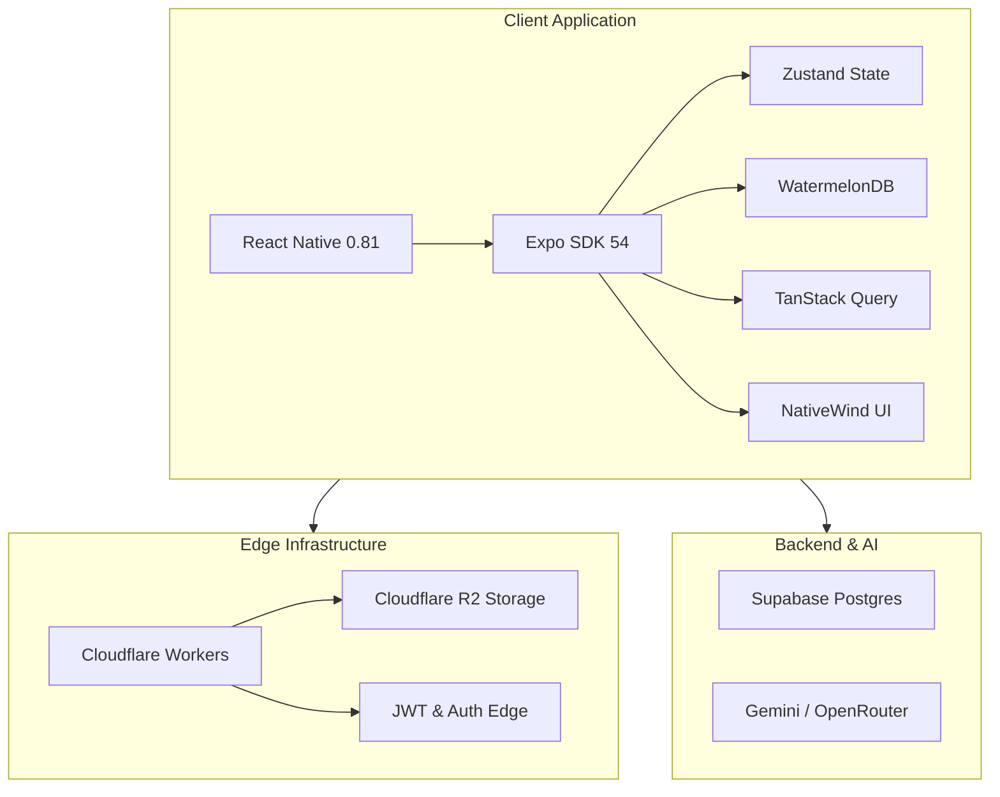

<div align="center">
  

  <h1>Echo</h1>
  <p><b>The Voice-Native, AI-Augmented Social Network</b></p>

  <p>
    <a href="https://github.com/Ak2556/echo-mobile/actions"></a>
    <a href="https://github.com/Ak2556/echo-mobile/releases"></a>
    <a href="https://github.com/Ak2556/echo-mobile/blob/main/LICENSE"></a>
    <a href="https://github.com/Ak2556/echo-mobile/issues"></a>
  </p>

  <p>
    <a href="#quick-start">Quick Start</a> •
    <a href="#architecture">Architecture</a> •
    <a href="#features">Features</a> •
    <a href="#contributing">Contributing</a> •
    <a href="#roadmap">Roadmap</a>
  </p>
</div>

---

## 📖 Executive Summary

**Echo** is an open-source, edge-AI powered social networking platform that challenges the text-centric paradigm of modern digital interaction. By leveraging sub-second voice-to-intent processing and real-time localization across 25 languages, Echo enables high-signal, frictionless global communication. 

Designed for venture-scale economics and elite developer velocity, the platform is built on a unified **Expo / React Native** architecture, backed by **Supabase**, **Cloudflare R2**, and **Google Gemini**.

## 🎯 Problem & Solution

### The Problem
Traditional social platforms are bottlenecked by the keyboard and fractured by linguistic boundaries. The friction of typing stifles complex thought, while algorithmic doom-scrolling optimizes for engagement over genuine human connection and utility.

### The Echo Solution
- **Voice-Native Interface:** Speak naturally. The AI structures, translates, and contextualizes raw audio instantly.
- **Global Inclusivity:** A thought spoken in one language is seamlessly debated across 25 different languages in real-time.
- **Utility-Driven Retention:** Integrated AI-powered mini-apps (finance, habits, fitness) embed the platform into users' daily workflows, creating a massive lifetime value (LTV).

---

## ✨ Key Features

| Feature | Description |
| :--- | :--- |
| 🎙️ **Voice-to-Intent** | Real-time audio processing that converts spoken thought into structured data, app navigation, and rich media posts. |
| 🌍 **Universal Translation** | Edge-AI localization ensures content is instantly accessible to a global audience, eliminating language barriers. |
| 🗓️ **The Daily Question** | A core engagement loop where users answer a single profound question daily, sparking global dialogue. |
| 🧩 **AI Mini-Apps** | A localized ecosystem of utility apps (planners, calculators, habit trackers) driven by a proactive AI copilot. |
| 🚀 **Zero-Egress Media** | End-to-end media pipelines routed through Cloudflare R2, fiercely protecting backend storage quotas. |
| ⚡ **Offline-First Sync** | Local-first architecture using WatermelonDB guarantees smooth usage under extreme network latency. |

---

## 📱 Previews & Demos

<table align="center">
  <tr>
    <td align="center"><br/><b>AI Co-Pilot</b></td>
    <td align="center"><br/><b>Daily Engagement Loop</b></td>
    <td align="center"><br/><b>Utility & Retention</b></td>
  </tr>
</table>

> *Demo videos and interactive web environments coming in v1.1.0*

---

## 🏗️ Architecture

Echo operates on an aggressively optimized, serverless-first architecture designed to process heavy AI workloads at the edge while keeping client payloads microscopic.

### System Workflow



### Tech Stack Visualization



---

## 📁 Project Structure

```text
echo-mobile/
├── .github/workflows/       # CI/CD pipelines (Fastlane, Pages)
├── app/                     # Expo Router file-based routing
├── assets/                  # Static assets and fonts
├── cloudflare/              # Cloudflare Worker scripts (Hono)
├── components/              # Shared React components
├── docs/                    # Architectural decisions & screenshots
├── lib/                     # API wrappers and utility functions
├── src/shared/database/     # WatermelonDB Models & Schema
├── desktop/                 # Electron configurations
└── babel.config.js          # Babel transformations (TS & Decorators)
```

---

## 🚀 Quick Start

### Prerequisites
- [Node.js](https://nodejs.org/) v20+
- [Expo CLI](https://docs.expo.dev/get-started/installation/)
- [Ruby 3.2+](https://www.ruby-lang.org/) (for iOS/Android Fastlane builds)
- [Supabase CLI](https://supabase.com/docs/guides/cli) (Optional, for local DB)

### Installation

1. **Clone the repository**
   ```bash
   git clone https://github.com/Ak2556/echo-mobile.git
   cd echo-mobile
   ```

2. **Install Dependencies**
   ```bash
   npm ci
   ```

3. **Environment Setup**
   ```bash
   cp .env.example .env
   ```
   *Populate the `.env` file with your Supabase, OpenRouter, and Cloudflare credentials.*

4. **Start the Development Server**
   ```bash
   npm start
   ```
   *Press `i` for iOS Simulator, `a` for Android Emulator, or `w` for Web.*

---

## ⚙️ Configuration & Deployment

<details>
<summary><b>Backend Configuration (Supabase & Cloudflare)</b></summary>
<br>

- **Supabase**: Echo relies on Row Level Security (RLS). Ensure your policies permit `SELECT`, `INSERT`, and `UPDATE` on the `users` and `messages` tables based on `auth.uid()`.
- **Cloudflare R2**: Create an R2 bucket and map its account ID in `wrangler.toml`.
- **Worker Deployment**: 
  ```bash
  cd cloudflare
  npx wrangler deploy
  ```
</details>

<details>
<summary><b>CI/CD Pipelines</b></summary>
<br>

Echo utilizes GitHub Actions for robust multi-platform CI/CD:
- **CI/Quality (`ci.yml`)**: Runs `npm run typecheck`, ESLint, and Jest tests on every PR.
- **Web Export (`gh-pages.yml`)**: Automatically conditionally swaps WatermelonDB to `LokiJS` and exports a static web build to GitHub Pages.
- **Android Beta (`android-beta.yml`)**: Builds release APKs using `fastlane` and deploys them to Firebase App Distribution.
</details>

---

## 👨‍💻 Development Workflow

### Git Branching Strategy
We follow a disciplined [Trunk-Based Development](https://trunkbaseddevelopment.com/) model:
- `main` is always stable and deployable.
- Feature branches follow the naming convention: `feat/issue-id-short-description` (e.g., `feat/12-voice-recorder`).
- Bug fixes: `fix/issue-id-short-description`.

### Coding Standards
- **Strict TypeScript**: No `any` types. Ensure interfaces are properly exported.
- **State Management**: Use `Zustand` for global UI state. Use `TanStack Query` for async server state. Use `WatermelonDB` strictly for offline-first persistent data.
- **Styling**: `NativeWind` (Tailwind CSS) exclusively. Avoid inline React Native `StyleSheet` objects unless dynamically calculated.

---

## 🤝 Contributing

We welcome contributions from the open-source community, whether it's fixing bugs, improving documentation, or proposing new features. 

1. Review the [Code of Conduct](CODE_OF_CONDUCT.md).
2. Check existing [Issues](https://github.com/Ak2556/echo-mobile/issues) before submitting a new one.
3. Follow the Pull Request workflow:
   - Fork the project.
   - Create a feature branch.
   - Run `npm run typecheck` and `npm run lint` before committing.
   - Submit a PR with a comprehensive description using the provided PR template.

### Issue Templates & PR Workflow
When opening an issue, please utilize the automated issue templates (`Bug Report`, `Feature Request`). All PRs require at least one approving review from a core maintainer before merging.

---

## 🔒 Security

Security is foundational to Echo. 
- All media uploads are authenticated at the edge via short-lived JWTs.
- Database access is strictly sandboxed via Supabase Row Level Security (RLS).
- **Reporting Vulnerabilities:** Please do not open public issues for security vulnerabilities. Email security@echo-network.example.com directly. See our [Security Policy](SECURITY.md) for details.

---

## 📈 Performance Highlights

- **Time-to-Interactive (TTI):** < 1.2s on mid-tier Android devices.
- **Bundle Size:** Aggressively code-split Webpack/Metro bundles ensuring the initial JS payload is < 3MB.
- **API Latency:** Edge-resolved authentication eliminates transatlantic database hops, reducing media upload initialization by 400ms.

---

## 🗺️ Roadmap

- [x] **v0.1**: Initial Proof of Concept (Voice-to-Text).
- [x] **v0.5**: Supabase Integration & Mini-app ecosystem foundation.
- [x] **v1.0**: Cloudflare R2 Migration, CI/CD Pipeline, Offline-first DB.
- [ ] **v1.1**: Real-time localized semantic search.
- [ ] **v1.2**: Desktop App (Electron) stable release.
- [ ] **v2.0**: Decentralized federated nodes protocol.

*For detailed milestones, view the [Project Board](https://github.com/Ak2556/echo-mobile/projects).*

---

## ❓ FAQ & Troubleshooting

<details>
<summary><b>Why is the Android Beta Build failing on GitHub Actions?</b></summary>
Ensure that `FIREBASE_APP_ID`, `FIREBASE_TOKEN`, and `FIREBASE_CREDENTIALS` are correctly configured in your repository secrets.
</details>

<details>
<summary><b>Metro Bundler crashes with a Babel error on Expo Web.</b></summary>
Ensure `@babel/plugin-transform-typescript` runs *before* `@babel/plugin-proposal-decorators` in your `babel.config.js`. (This is configured by default in the current `main` branch).
</details>

---

## 📜 License & Acknowledgements

Echo is open-source software licensed under the [MIT License](LICENSE).

Special thanks to the maintainers of **Expo**, **WatermelonDB**, and **Hono** for pushing the boundaries of cross-platform and edge-compute development.

---

<div align="center">
  <b>Engineered & Architected by <a href="https://github.com/Ak2556">Akash Thakur (Ak2556)</a></b><br/>
  <i>For inquiries, investments, or technical partnerships, reach out on <a href="https://github.com/Ak2556">GitHub</a>.</i>
</div>
