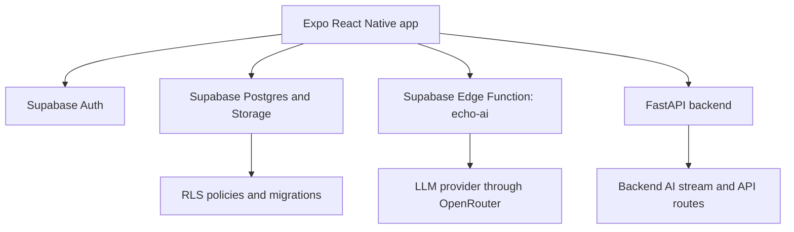

# Architecture Overview

Echo is split into mobile frontend, shared TypeScript utilities, Supabase services, and an optional FastAPI backend. The safest launch posture is to keep those boundaries clear.

## Frontend

Primary paths:

- `app/` for Expo Router screens and route layouts.
- `components/` for UI, social, AI, notification, profile, and mini-app components.
- `hooks/` for network and TanStack Query hooks.
- `store/` for Zustand state slices and persistence.
- `constants/` and `assets/` for visual and app constants.

Frontend changes should preserve navigation contracts, auth flows, and query keys unless the owning team approves a coordinated change.

## Shared TypeScript

Primary paths:

- `lib/` for API clients, Supabase mapping, local tools, theme, motion, caching, and utility modules.
- `types/` for shared TypeScript interfaces.

Shared utilities are high-blast-radius. Keep changes small, tested, and compatible with existing callers.

## Backend/API

Primary paths:

- `backend/main.py` for FastAPI routes.
- `backend/db/` for backend database helpers and reference schema.
- `backend/requirements.txt` for Python dependencies.

The current FastAPI service is secondary to the Supabase-backed mobile path. Treat route changes as API contract changes and coordinate with frontend owners.

## AI/LLM

Primary paths:

- `supabase/functions/echo-ai/` for the primary Edge Function AI path.
- `lib/api.ts` for client streaming and retry behavior.
- `lib/aiMemory.ts` and `lib/aiTitle.ts` for AI-adjacent helpers.
- `backend/main.py` for the legacy/local chat stream.

AI changes must consider streaming UX, abort/retry behavior, environment secrets, cost, model availability, and provider fallback.

## Database

Primary paths:

- `supabase/migrations/` for versioned Supabase migrations.
- `backend/db/schema.sql` as a reference schema.
- `supabase/config.toml` for local Supabase configuration.

Prefer additive migrations. RLS policy changes require security review because they affect data exposure.

## Infrastructure and DevOps

Primary paths:

- `.github/workflows/ci.yml` for CI validation.
- `.github/workflows/aws.yml` for ECS deployment workflow configuration.
- `app.json` and `eas.json` for Expo/EAS behavior.
- `.dockerignore` for future Docker build context hygiene.

Deployment behavior should not change as part of feature work unless the DevOps owner approves the rollout plan.

## Current Fragile Areas

- The AWS deploy workflow references Docker/ECS assets that are not fully represented in the repository.
- Native `ios/` and `android/` folders are local generated outputs and ignored by Git.
- Supabase credentials are split between public Expo variables and backend/Edge Function secrets.
- Shared utilities in `lib/` are used across many screens and need focused tests for behavioral changes.
